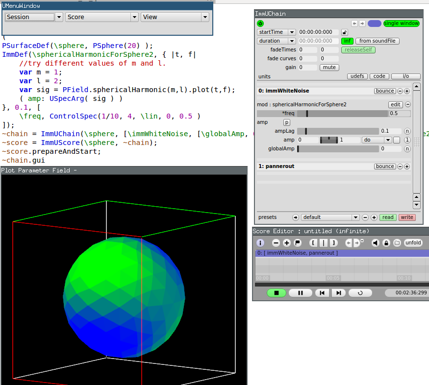

ImmLib - A SuperCollider library for immersive spatialization.

Description
-----------

ImmLib is a SuperCollider library for spatial composition with grid-based loudspeaker systems in the context of computer sound synthesis and audio processing which places emphasis on immersiveness and a global approach to space. It implements techniques for dealing with multiple decorrelated, but perceptually similar, sound streams spatialized at different locations in space with the aim of creating an expanded, broad or diffuse sound sources with interesting musical spatial properties. The tool, implemented in SuperCollider, automates the process of creating decorrelated streams from a synthesis definition and provides mechanisms to create and control spatial patterns in a virtual surface by modulating synthesis parameters of the sound processes using different (but coherent) signals for each of the running instances. The main abstraction is the parameter field which defines ways to control the spatial patterns across space based on mathematical functions defined on a surface.



Install
-------

Requires 

* SuperCollider from current master (commit 2fdb730407454fd2b522462669447e9dade42b1e or higher ) which can be downloaded for OSX [here](http://supercollider.s3.amazonaws.com/builds/supercollider/supercollider/osx/master-latest.html).
* sc3-plugins available [here](https://github.com/supercollider/sc3-plugins)
* [ATK kernels](http://www.ambisonictoolkit.net/wiki/tiki-index.php?page=Downloads)

note:
In order for pfVisualizer to work properly a copy of SuperCollider built from commit 2fdb730407454fd2b522462669447e9dade42b1e or higher is needed.


The easy way:

With SuperCollider downloaded from the link above the library can by simply installed by running the following one liner. If you have any of the libraries mentioned below installed please uninstall them first, since for ImmLib, specific versions are required.

```
Quarks.install("https://github.com/miguel-negrao/ImmLib.git","v0.1.6")
```
The hard way:

The following libraries should be downloaded/cloned from github:

* wslib - tag 'immlib-v0.1.0' [github](https://github.com/miguel-negrao/wslib)
* FP Lib - tag 'v0.2.0' [github](https://github.com/miguel-negrao/FPLib).
* UEvNetMod - tag 'v0.1.0' [github](https://github.com/miguel-negrao/UEvNetMod).
* Modality - tag 'immlib-v0.1.0' [github](https://github.com/miguel-negrao/Modality-toolkit).
* Unit Lib - tag 'immlib-v0.1.1' - [github](https://github.com/miguel-negrao/Unit-Lib/).
* WFSCollider class library - tag 'immlib-v0.1.0' - [github](https://github.com/miguel-negrao/WFSCollider-Class-Library/).
* PopUpTreeMenu - [github](https://github.com/miguel-negrao/PopUpTreeMenu)

The following quarks should be installed:

* VectorSpace
* MathLib
* JITLibExtensions
* NetLib

Getting started
---------------

Read the tutorial in the "ImmLib tutorial" SuperCollider help file and the "ImmLib" help file for startup code.

Note that after installing ImmLib you need to quit and then start scide in order for the help files to become visible.

minimal code to get started:

Run once:
```
ULib.writeDefaultSynthDefs
```

Start system in stereo binaural preview:
```
(
var o = ServerOptions()
.memSize_(8192*16)
.numWireBufs_(64*2)
.numPrivateAudioBusChannels_(1024)
.maxSynthDefs_(2048)
.maxNodes_(4*1024)
.numOutputBusChannels_(2);
Routine({ ImmLib.startupStereo(numServers:2, serverOptions:o, startGuis:true ) }).play(AppClock)
)
```

Start one event:
```
(
PSurfaceDef(\sphere, PSphere(30) );
~chain = ImmUChain(\sphere, [\immWhiteNoise, [\globalAmp, 0.1], ImmMod(\wave2DSin)] );
~score = ImmUScore(\sphere, ~chain);
~chain.gui;
~score.gui;
~score.prepareAndStart
)
```


sc3plugins
----------

In order to use the decorrelate unit you must install a patched version of sc3-plugins including PV_Decorrelated available in [github](https://github.com/miguel-negrao/sc3-plugins) in the 'pv' branch. You can download the source from [here](https://github.com/miguel-negrao/sc3-plugins/archive/pv.zip) and compile it.

If you don't need the 'decorrelate' unit just install the normal sc3-plugins from [github](https://github.com/supercollider/sc3-plugins).

supercollider patches
---------------------

ImmLib creates a large number synths (number of events x number of points of surface). When the synths are freed they send a message back to sclang. When many synths stop at the same time the number of messages sent back can be bigger then the max number of messages scsynth can send. When this happens ImmLib will stop working properly. In order to avoid this the max number of messages must be increased in scsynth. There is a commit adressing that [here](https://github.com/miguel-negrao/supercollider/commit/2d7fe37e3707acb8543314595ec2ccbb0cf22a90). This issue will affect scores with a large number of simultaneous events.

ImmLib creates a lot of OSC trafic with the server. It is therefore recommended to run the server in tcp mode. Connecting and disconnecting from a tcp server is not automatic in sc3.6. A patch for that is available currently [here](https://github.com/miguel-negrao/supercollider/tree/tcpConnect).

For scores with low number of events or just for trying out ImmLib these two patches are not needed.

pfVisualizer
------------

ImmLib uses an external process to render 3D representations of surfaces and parameter fields using openGL. The library ships with binaries of pfVisualizer for OSX 10.10 (untested in lower versions) and Ubuntu 12.04 and higher.  If the bundled version does not work on your system then it must be compiled from source.

There is a binary available for Debian 7 and higher at https://github.com/miguel-negrao/pfVisualizer/releases.

To compile it from source download the source from github at https://github.com/miguel-negrao/pfVisualizer . Use either the .tar download link or git.
You must have a working haskell system installed, see https://www.haskell.org/platform/. On linux you must have some opengl packages installed.

cd pfVisualizer
cabal sandbox init
cabal install --only-dependencies
cabal build

then copy the binary to ImmLib/pfVisualizer/osx or ImmLib/pfVisualizer/linux.

You can also compile the binary with the nix package manager which takes care of all the linux dependencies, for more info see the [readme of pfVisualizer](https://github.com/miguel-negrao/pfVisualizer).

Documentation
-------------

See the help files and the [ICMC paper](http://www.friendlyvirus.org/files/miguelnegraoicmc2014.pdf).


License
-------

ImmLib is free software; you can redistribute it and/or modify it under
the terms of the GNU General Public License version 3 as published by the Free Software Foundation. See [COPYING](COPYING) for the license text.
